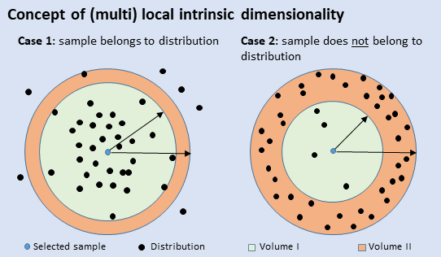

# Detection Synthetic Diffusion Generated Images Using multi Local Intrinsic Dimensionality

<b>Peter Lorenz, Ricard Durall, and Janis Keuper</b>


## Abstract
Diffusion models have recently been successfully applied for the visual synthesis of remarkably realistic images. However, this raises significant concerns about their potential misuse for malicious purposes. In this paper, we propose a solution using the lightweight multi Local Intrinsic Dimensionality (multiLID) method, originally developed for detecting adversarial examples, to automatically detect synthetic images and identify the corresponding generator networks.
Unlike many existing detection approaches that may only work effectively for GAN-generated images, our proposed method achieves close-to-perfect detection results in various realistic use cases. Through extensive experiments on known and newly created datasets, we demonstrate the superiority of the multiLID approach in diffusion detection and model identification. Additionally, while recent publications primarily focus on the "LSUN-Bedroom" dataset for evaluating the detection of generated images, we establish a comprehensive benchmark for the detection of diffusion-generated images. This benchmark includes samples from several diffusion models with different image sizes.

<!-- <p align="center">

</p> -->

## Method - multiLID
<p align="center" width="100%">
  
</p>

The underlying concept of the proposed method is to distinguish models by differences in the density of their internal feature distributions. LID estimates densities in the feature spaces of pre-trained CNNs, by computing fractions over the number of samples in given volumes: ∣volume I∣/∣volume II∣ < 1. The example above shows how this density measure indicates if the selected sample belongs (left) or does not belong (right) to a reference distribution.

<p align="center" width="100%">
  
</p>

Limitation of the identification. Left: As described in section 4.1, our experiment is based on ArtiFact and consists of 8 clean datasets, 6 GAN, and 6 DM-generated images. Center: Identification results on the dataset of LSUN-Bedroom. Right: Transferability results on the dataset of LSUN-Bedroom. The transferability is low, while the identification between clean and synthetic images is accurate. 


## Installation and run an Example

###  Environment Installation

```
conda env create -f environment.yml
```

### Run Pipeline

The pipeline consists of 3 sequential steps: Generate data, extract features, and detect synthetic data.

#### Create Dataset

In the folder `configs/scripts` you will find different scripts for running the datasets, i.e. I select the `cifake.sh`. 

```
python gen.py --load_json cifake/nor_cifake.json # normal files
python gen.py --load_json cifake/adv_cifake.json # adversarial / synthatic data
```
Each of the scripts stores the CiFake dataset in the `.pt` file format. If the preference is to store images within a designated folder in either `.png` or `.jpg` format, I recommend examining the content of the file named `configs/gen/256/adv_ddpm_ema_lsun-bedroom256.json`, as it pertains to the saving of images in the png format.

Should the need arise to transform files from `.pt` to `.png`, the script titled `saveaspng.py` is available for reference. Conversely, if there is a requirement to convert files from `.png` to `.pt`, the script denoted as `pngtotorch.py` should be consulted.

Note that depending on the Diffusion Model A100 with 40GB is recommended.

#### Extract Features

```
python extract.py --load_json cifake/rn18_cifake_multiLID.json
```
Note that the extraction runs mainly on the CPU. Plenty of RAM is necessary depending on the images size. 

#### Detect Code

```
python detect.py --load_json cifake/rn18_rf_cifake_multiLID.json
```

Note that only CPU is needed.


## Citation

Please, cite our [paper](https://arxiv.org/pdf/2307.02347.pdf):

```
@misc{lorenz2023detecting,
      title={Detecting Images Generated by Deep Diffusion Models using their Local Intrinsic Dimensionality}, 
      author={Peter Lorenz and Ricard Durall and Janis Keuper},
      year={2023},
      eprint={2307.02347},
      archivePrefix={arXiv},
      primaryClass={cs.CV}
}
```


## Acknowledgments
Our code is developed based on [multiLID](https://arxiv.org/pdf/2212.06776.pdf), [DDPM](https://arxiv.org/abs/2006.11239) and [huggingface](https://huggingface.co/). 
Thanks for sharing codes and models.
