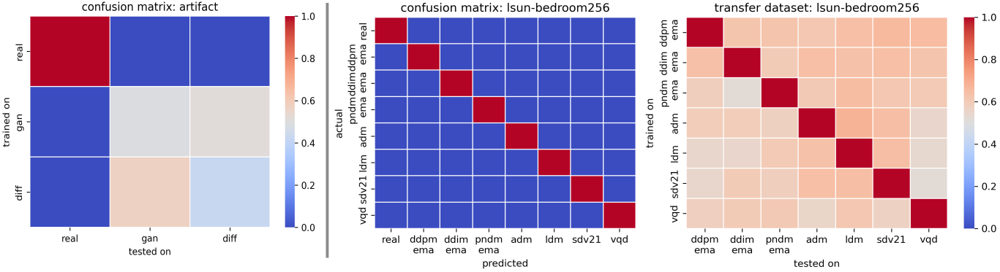

# Detection Synthetic Diffusion Generated Images Using multi Local Intrinsic Dimensionality

<b>Peter Lorenz, Ricard Durall, and Janis Keuper</b>

[[Paper](https://arxiv.org/pdf/2307.02347.pdf)] [[Code (Comming Soon)]()] 

## Abstract
Diffusion models have recently been successfully applied for the visual synthesis of remarkably realistic images. However, this raises significant concerns about their potential misuse for malicious purposes. In this paper, we propose a solution using the lightweight multi Local Intrinsic Dimensionality (multiLID) method, originally developed for detecting adversarial examples, to automatically detect synthetic images and identify the corresponding generator networks.
Unlike many existing detection approaches that may only work effectively for GAN-generated images, our proposed method achieves close-to-perfect detection results in various realistic use cases. Through extensive experiments on known and newly created datasets, we demonstrate the superiority of the multiLID approach in diffusion detection and model identification. Additionally, while recent publications primarily focus on the "LSUN-Bedroom" dataset for evaluating the detection of generated images, we establish a comprehensive benchmark for the detection of diffusion-generated images. This benchmark includes samples from several diffusion models with different image sizes.

<!-- 

 -->

## multiLID

  

  

## TODO
- [ ] Release code.

## Acknowledgments
Our code is developed based on [multiLID](https://arxiv.org/pdf/2212.06776.pdf), [DDPM](https://arxiv.org/abs/2006.11239) and [huggingface](https://huggingface.co/). 
Thanks for their sharing codes and models.
